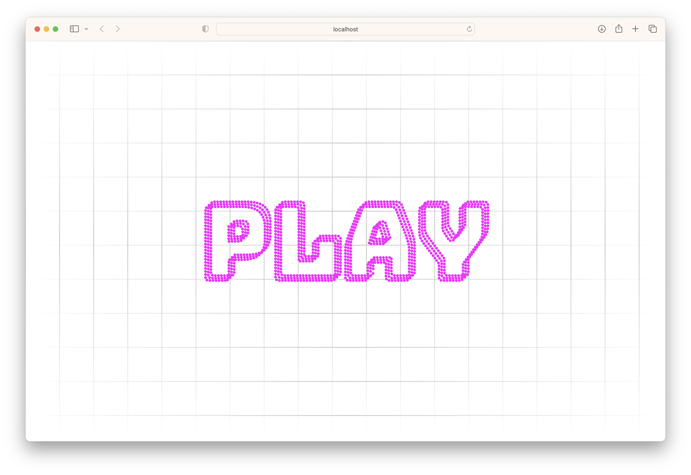
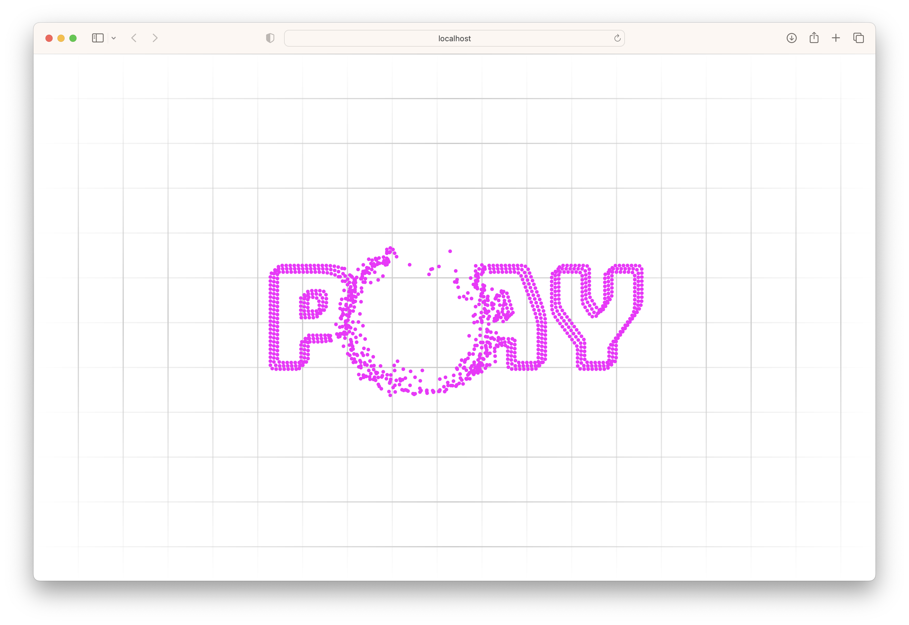

*This projects skeleton was created by [Compose Multiplatform Template Wizard](https://terrakok.github.io/Compose-Multiplatform-Wizard/).*

# Particle Physics Project | Compose Multiplatform

This project is a basic physics simulation built on Multiplatform Compose Canvas. It has the same capabilities as any other vector driven particle system. 

Showcase example is a text/image rendering using small particles and a radial repelling force (created by pointer).

## Before running!
 - check your system with (KDoctor)[https://github.com/Kotlin/kdoctor]
 - install JDK 8 on your machine
 - add `local.properties` file to the project root and set a path to Android SDK there
 - run `./gradlew podInstall` in the project root

### Android
To run the application on android device/emulator:  
 - open project in Android Studio and run imported android run configuration

To build the application bundle:
 - run `./gradlew :composeApp:assembleDebug`
 - find `.apk` file in `composeApp/build/outputs/apk/debug/composeApp-debug.apk`

### Desktop
Run the desktop application: `./gradlew :composeApp:run`

### iOS
To run the application on iPhone device/simulator:
 - Open `iosApp/iosApp.xcworkspace` in Xcode and run standard configuration
 - Or use (Kotlin Multiplatform Mobile plugin)[https://plugins.jetbrains.com/plugin/14936-kotlin-multiplatform-mobile] for Android Studio

### Browser
Run the browser application: `./gradlew :composeApp:jsBrowserDevelopmentRun`

